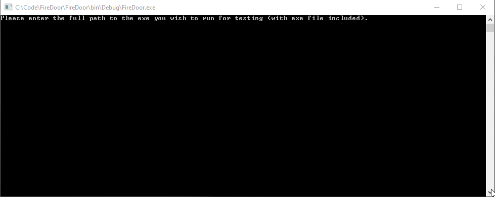
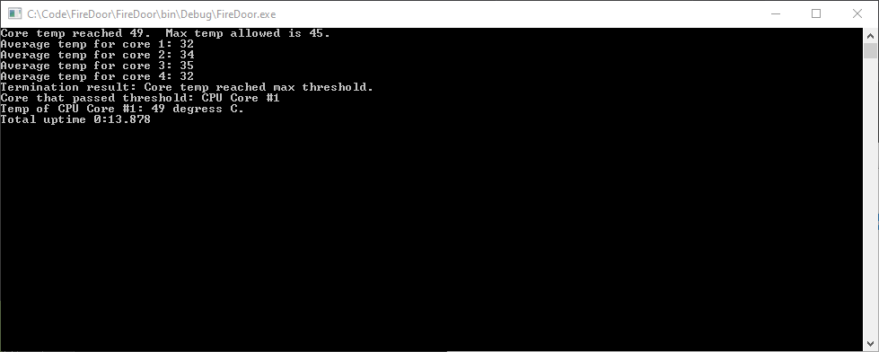

# FireDoor
## Description
Firedoor is a .NET 4.8 application that allows users to measure the temperature of their CPU's cores without having to manually monitor them.
It was created from a need to ensure that long-term heat would not damage the chip.  The user starts by specifying which resource-intensive application they plan to test.  The user will then have an opportunity to define the max temperature they are willing their CPU cores to reach.  The application specified will then start, and FireDoor will monitor the temperatures in the background.  If a core goes past the maximum temperature specified, FireDoor will exit the test app to help prevent long term heat damage from being done to the CPU.  It should be noted that FireDoor is NOT meant to overclock CPUs; it acts as supplemental software that allows users to safely test their overclocked settings.  
 
## How To Use

1. Open the program and enter the path of the app you wish to test.

2. If your games are tied to a digital provider's launcher, you will be prompted to start the launcher before moving forward.  Please note that FireDoor cannot detect if the launcher is running or not, and will attempt to open your app if you press ENTER without opening the launcher.  In the gif below I am attempting to open DOOM (2016), which is tied to my Steam account.  In the example, my launcher is already open, so I have gone ahead and pressed ENTER.

3. Enter the maximum temperature you are willing a CPU core to reach (in celcius).

4. Wait while FireDoor loads your app.

Firedoor will collect your CPU core temps, then wait 10 seconds.  From there, it will collect the tempratures of each CPU core once every second, until you test app's process is terminated.  Termination is acomplished by manually ending the app's process, or by a CPU core temp exceeding the maximum specified temperature.

When the test app's process has terminated, FireDoor will show a report containing the following information:
- The average temperature per core.
- The reason for the termination.
- The amount of time the test app ran before its process was terminated.  

Below is a screenshot of the results I get back from FireDoor if my max temp (45 degrees C) is exceeded while running my test app.

I would get a similar screen back if I exited the test app myself, with the only difference being that my Termination Result would say "Process terminated by user".

## Dependencies and Nuget Packages
- OpenHardwareMonitorLib: A DLL of OpenHardwareMonitorLib has been included in this app.  It includes libraries that allow the developer to 
measure CPU temps.  Unfortunately, no Nuget package for this library was available, which is why the DLL is in source control.  The library
also targets .NET 2.0, which is why FireDoor is written in .NET 4.8 instead of .NET Core.

- Fody and Costura.Fody: Used to include OpenHardwareMonitorLib in any executable (EXE) file generated by building.  This ensures that any EXE pulled from your Debug folder can act as a standalone program.   
 
## FAQ
<strong>What is the app.manifest file for?</strong>
 
The app.manifest file allows Visual Studio to run the code with admin privileges.  Without it, the app is unable to read the temperature of each core.
 
<strong>FireDoor sees more cores on my CPU than I am expecting.  What's the deal?</strong>
 
FireDoor uses a DLL from OpenHardwareMonitor to call libraries that will read the temperature of each logical core (the number of physical cores on your CPU times the amount of threads each core runs).  For example, let's say my CPU has two physical cores, and each core can run two threads.  OpenHardwareMonitor will seem them as four cores when reading CPU core temperatures on my PC.  

<strong>Why is there one ten second delay before temps are collected after each second?</strong>

The delay gives FireDoor the oppurtunity to ensure the process is fully started before collecting temps.  Without it, FireDoor will be unable to locate apps that time time to start, and will believe that the process has already ended. 

<strong>What is FodyWeavers.xml for?</strong>

This file specifies that OpenHardwareMonitorLib is bundled into any EXE generated by a build.  Removing this file will stop this process from happening, meaning that generated EXE files will not be able to be used as standalone programs outside the folder they were created in.

<strong>My app has its own launcher.  How can I move forward with testing? </strong>

At this time, apps with their own launchers are unable to be tested.

